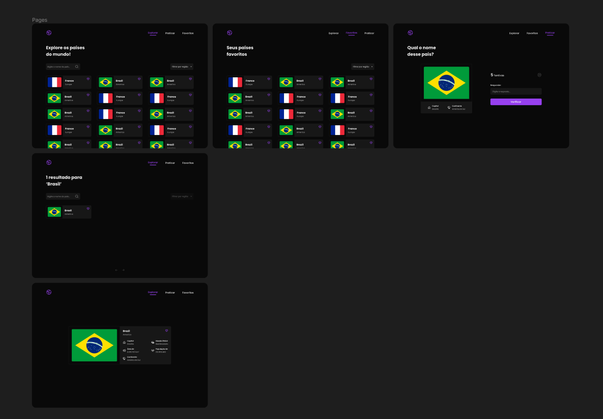

<h1 align="center">
    
    <br>
    FunGeo! Website para brincar e aprender Geografia.
</h1>

O usuário pode explorar, favoritar e ser desafiado com os países do mundo. Para uma melhor navegação possui filtros, barra de pesquisa e paginação.

Os favoritos são salvos e persistidos no armazenamento local do dispositivo, então quando sair vai manter esses dados salvos.

Também, possui uma sessão de desafio. O algoritmo vai escolher um país aleatório, sem repetir, e o usuário terá que descobrir o nome desse país, baseando-se
em informações disponíveis como: Capital, bandeira e região. O usuário tem 5 tentativas antes do desafio falhar. Por fim, é mostrado o status daquele desafio
e o país selecionado atualmente vai para uma lista de países que já foram escolhidos.

<h2>Tecnologias:</h2>

- [VueJS](https://br.vuejs.org/)
- [Typescript](https://www.typescriptlang.org/)
- [Vue Router](https://router.vuejs.org/)
- [Pinia](https://pinia.vuejs.org/)
- [SASS/SCSS](https://sass-lang.com/)
- [Phosphor Icons](https://phosphoricons.com/)

<h2>Dificuldades:</h2>

- Passei um sufoco para atualizar a tela de resultados de pesquisa quando a query da URL mudasse. Tive que usar o :key disponível pelo Vue para forçar uma nova renderização.
- A API não possui paginação e estava renderizando muitos elementos diretamente no documento. Com certeza, iria travar em algum dispositivo mais fraco. Então,
tive a idéia de usar uma Virtual Scroll List ou fazer uma paginação direto no front. Por fim, tive que optar pela paginação, pois a outra opção não funcionou.

<h2>Prototipagem:</h2>

<div align="center">
  
</div>

<h4 align="center">Feito com <a href="https://www.figma.com/" target="_blank" rel="noreferrer">Figma</a></h4>

<h2>Rodando o projeto:</h2>

Você precisa ter o [Node](https://nodejs.org/en/), o [Git](https://git-scm.com/) e algum gerenciador de pacotes([NPM](https://docs.npmjs.com/downloading-and-installing-node-js-and-npm/) | [Yarn](https://classic.yarnpkg.com/lang/en/docs/install)) instalados em sua máquina.

```bash
1. Clone o repositório:
$ git clone https://github.com/gabriellima2/fun-geo.git

2. Acesse a pasta e instale as dependências via terminal:
$ yarn || npm i

3. Inicie a aplicação em modo de desenvolvimento:
$ yarn dev || npm run dev

4. O servidor será aberto em http://localhost:5173
```

<p align="center">Projeto feito com 💙 por <a href="https://www.linkedin.com/in/gabriel-lima-860612236">Gabriel Lima</a></p>
